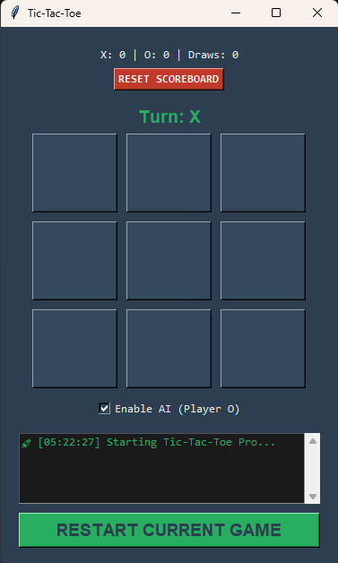

<div align="center">
  <strong>🇺🇸 English (Main)</strong> | 
  <a href="README.es.md">🇪🇸 Español</a> | 
  <a href="README.pt.md">🇧🇷 Português</a>
</div>
<br>

# 🎮 Tic-Tac-Toe


**Tic-Tac-Toe** is a desktop game I built to practice Python GUI development. It allows you to play against a basic AI or a friend locally, and it keeps track of your score history.

My main goal with this project was to practice how to structure a larger script, manage state in Tkinter, and use JSON for data persistence.

---
## 📸 Preview
<div align="center">
  
  <p><em>Interfaz del juego con el Activity Log y el Marcador persistente.</em></p>
</div>

## 🚀 Features

* **Basic AI:** I implemented a simple logic where the computer tries to win first, and if it can't, it blocks your move.
* **Scoreboard:** The game saves your wins, losses, and draws to a `game_stats.json` file so you don't lose progress when closing the app.
* **Activity Log:** A text area that shows what's happening in the game (turns, wins, resets) with timestamps.
* **Clean UI:** Dark theme customized with specific colors instead of the default Tkinter look.
---

## 📂 Project Structure

I tried to keep the code organized by separating the configuration from the main logic:

```text
Tic-Tac-Toe/
│
├── main.py                # Application entry point and GUI logic
├── constants.py           # Centralized colors, fonts, and messages
├── game_stats.json        # Local database for scores (auto-generated)
└── README.md              # Multilingual documentation
```

## 🛠️ Prerequisites
 
* **Python 3.x installed**
* **Tkinter library** (usually included with standard Python installations)

## 📥 Installation & Setup
*Clone the repository:*
 ```bash
 git clone [https://github.com/Davids-Pereira/Tic-Tac-Toe.git](https://github.com/Davids-Pereira/Tic-Tac-Toe.git)
cd Tic-Tac-Toe
```
*Run the application:*
```bash
python main.py
```
## 🖥️ Usage

Enable AI: Check the box to play against the computer (Player O). Uncheck it for local 2-player mode.

Restart Game: Clears the board for a new round.

Reset Scoreboard: Wipes the history from the JSON file.

---

## 🔧 Technologies Used
* Core: Python 3 (Functional approach)
* GUI: Tkinter
* Data Persistence: JSON (Standard Library)
* Utilities: os.path for portability, time for logging.

## 📄 License
This project is licensed under the MIT License - see the [LICENSE](LICENSE) file for details.


## Done by Davids-Pereira 👨‍💻
Focused on Integrity, Functional Logic, and Scalable Solutions.